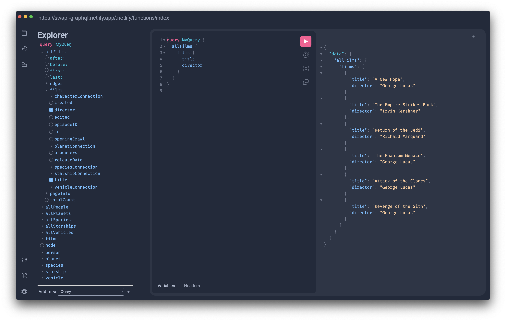

# graphiql-desktop 

> Electron-based desktop application for GraphiQL 2

## Installation

Just head to the [releases](https://github.com/nathanchapman/graphiql-desktop/releases) page, download the binary for your operating system, and install.

## Additional Features

In addition to all of the features of [GraphiQL 2](https://github.com/graphql/graphiql), `graphiql-desktop` adds support for specifying the GraphQL server URL, saving the current state of the UI to local storage, and several keyboard shortcuts unique to the desktop application.

### Shortcuts

`⌘D` - Show `Docs`

`⌘K` - Search

`⌘Y` - Show `History` View

`⌘E` - Show `Explorer` View

`⌘R` - Reload Schema

`⌘T` - New Tab

`⌘W` - Close Tab

`⌘1` through `⌘9` - Show Tab `N`

`⌘0` - Show Last Tab
